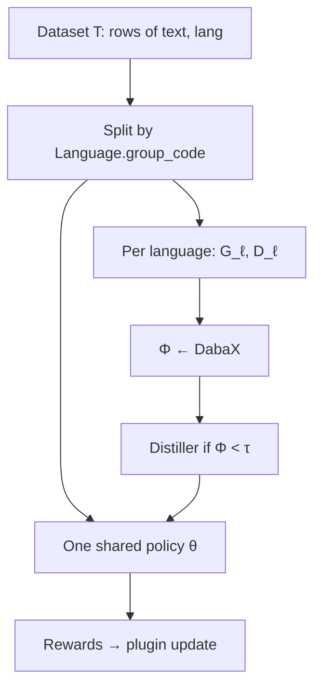
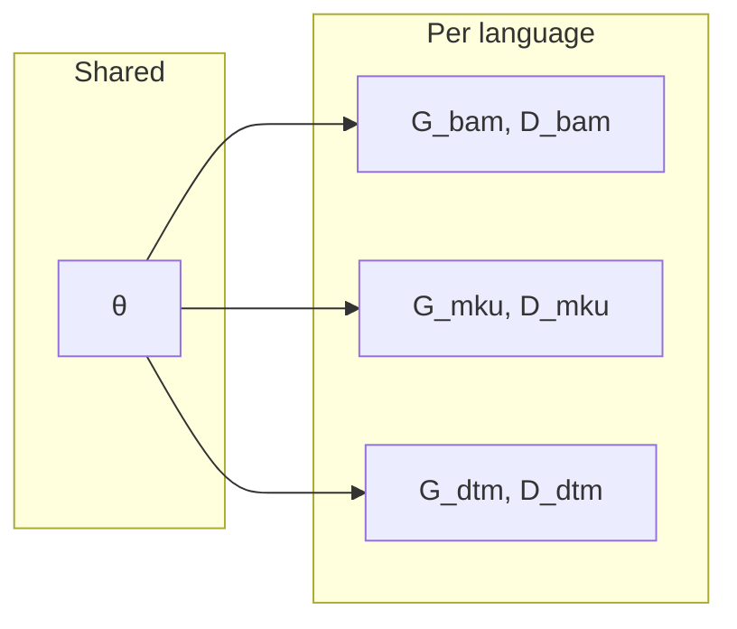
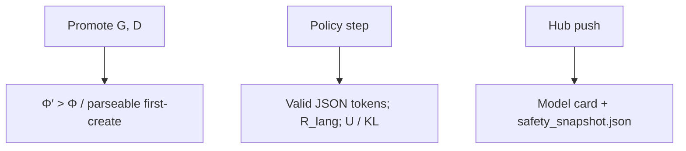

# Architecture

Sebeni is a recursive loop between a rule-based morphological analyzer (Daba)
and a small language model (SLM). Nothing in this page is FastText,
Matryoshka embeddings, or a chatbot — those tracks are out of scope.

Public URL: [https://seben.robotsmali.org/docs](https://seben.robotsmali.org/docs).

## Three product phases

1. **Distill resources** — lexical references (`\va` / `\ve` variants) become
   a SIL Toolbox **grammar G** and **dictionary D**. Frontier LLMs synthesize
   Daba pattern files; HITL (`--hitl`) validates Select-Mark
   `pattern select_gloss | mark_gloss` and compounding such as `:n: [ :v: :n: ]`.
2. **Refine G/D while training** — Daba is a **dynamic checkpoint**. If Φ on a
   training batch is below τ, Distiller proposes \(G_{cand}, D_{cand}\)
   and Sebeni promotes only when Φ′ > Φ.
3. **Update θ** — GRPO (default) samples a group of completions and
   scores them with Daba. DPO / APO are drop-in **policy-update plugins**.



## One θ, many (G, D)



## SafetyGovernor gates



## Objects

| Symbol | Role |
| --- | --- |
| \(T\) | Alignment dataset: `{text, lang}` rows |
| \(B_ℓ\) | Texts in the batch whose group code is ℓ |
| \(G_ℓ, D_ℓ\) | Daba `.gram` / `.dict` for that group |
| \(\Phi_ℓ\) | Mean token stage score of \(B_ℓ\) given \(G_ℓ, D_ℓ\) |
| \(\tau\) | Default **0.5** |
| \(\theta\) | **One** shared policy, even when \(T\) is multilingual |
| Distiller | Proposes G, D (not `distillation_hook`, which is KL scaling) |

## Package layout

```
beni/
  cli/main.py              sebeni init|train|distill|eval|exp|wordfreq|generate|push
  core/srl/                SAMPG + GRPO/DPO/APO plugins
  core/safety/             SafetyGovernor gates
  core/compute/            Φ, MER, MCS, U, RewardManager
  core/morphotactic/       Distiller, DabaX (CLI daba.mparser)
  core/language.py         ISO → group_code (mku, mey, kao, spp)
  core/hub/                model cards
  core/wordfreq/           surface / lemma / morpheme / stage counts
  data/baselines/{lang}/   packaged G, D (Maninka files may live under mlq/)
  data/raw/                packaged train texts for sebeni exp
  data/test.json           packaged eval texts for sebeni exp
  utils/                   workdir, prompts, language metadata
```

Relocatable workdir (later wins): `~/.sebeni` → `SEBENI_HOME` /
`SEBENI_WORKING_DIR` → YAML `working_dir` → CLI `-w`.

| Path under workdir | Contents |
| --- | --- |
| `data/baselines/{lang}/` | `baseline.gram` / `.dict`, then `baseline_vN` |
| `models/` | Policy, tokenizer, Hub `README.md`, `safety_snapshot.json` |
| `exp/` | `eval.json`, `wordfreq/` |
| `runtime/` | Headless mparser scratch |

## What Sebeni does *not* do

- Vendor GPL `daba` sources (install maslinych/daba from GitHub with
  `--no-deps` for its CLI modules).
- Require wxPython (`[gui]` is optional for upstream gparser).
- Treat G or D as dataset columns.
- Mix languages **inside** one completion JSON object (`R_lang` is 0).
