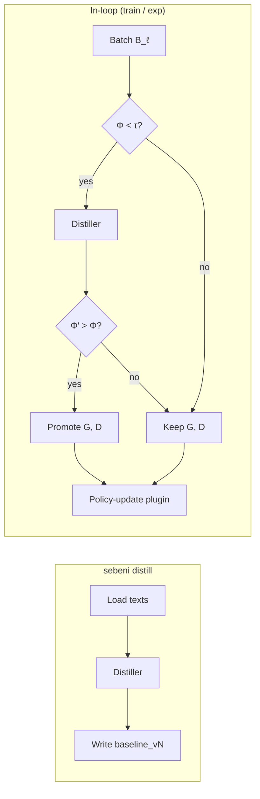

# Distillation and DabaX

Distiller in SAMPG proposes candidate grammar and dictionary files when Φ on a
batch of **texts** falls below τ. Sebeni promotes them only if Φ′ > Φ (and
SafetyGovernor agrees). There is no separate `refgen` package.



`sebeni distill` writes G, D **without** a policy step. `sebeni train` /
`sebeni exp` run the same Distiller path automatically (per language in the
batch) via `SelfAwareCallback`. `distillation_hook` is KL scaling, not Distiller.

## What Distiller writes

Daba-compatible **G** (`.gram` finite-state / Select-Mark rules) and **D**
(`.dict` SIL Toolbox / MDF fields), synthesized from lexical references:

```
pattern select_gloss | mark_gloss
:n: [ :v: :n: ]
```

Heuristic updates decide whether a miss is:

- a missing lemma (`\lx`) in **D**, or
- a missing splitter / constraint in **G** (e.g. `{|na}`).

Promoted files are versioned `baseline_vN` under
`{working_dir}/data/baselines/{lang}/`.

## CLI

```bash
export GOOGLE_API_KEY=...   # or OPENAI_API_KEY / GROQ_API_KEY / TOGETHER_API_KEY
sebeni distill -c config.yaml
sebeni distill -c config.yaml --lang bam --lang mku --hitl
```

Use `distill` when you want G, D without a policy step.

## Providers

`google` / `gemini` (default), `openai`, `groq`, `together`. YAML:

```yaml
distillation:
  enabled: true
  provider: google          # google | gemini | openai | groq | together
  model: gemini-2.5-flash
  tau: 0.5
  hitl: false
  auto_update_baselines: true
  batch_size: 10
```

Keys stay in the environment. Cache/upload is Google-only; other providers use
`ProviderCapability.NONE`.

## Scratch bootstrap

No packaged `beni/data/baselines/{lang}/` → Distiller writes stubs under the
workdir and uses **bootstrap** prompts (full G, D — not `[ADD]`/`[REPLACE]`).

| Promote | Gate |
| --- | --- |
| First create | files must be **parseable** by DabaX |
| Later `baseline_vN` | Φ′ > Φ on **that language's** batch texts |

`--hitl` prints a grammar/dictionary head and asks `[y/N]`. Skipped when stdin
is not a TTY (CI).

## DabaX

Wraps CLI `daba.mparser` (`DictLoader`, `GrammarLoader`, `Tokenizer`,
`Processor`). No wxPython / `gparser` / `gdisamb` on the default install.
Upstream credit: [maslinych/daba](https://github.com/maslinych/daba) (GPLv2+).
Do not vendor GPL sources into this MIT tree.

```python
from beni.core.morphotactic.distil.distillation import Distiller
from beni.core.morphotactic.dabax import DabaX

d = Distiller(lang_code="bam", provider="google", working_dir="./runs/bam")
d.handle_baselines()
phi = d.phi_on_texts(["Aw ka kɛnɛ wa?"])

dx = DabaX("bam", gram=d.gram_path, ldict=d.dict_path, process=True)
sentences = dx.loader("Aw ka kɛnɛ wa?")
```

Φ here is morphological integrity of the **strings**, given G and D — the
same quantity SAMPG compares to τ.
