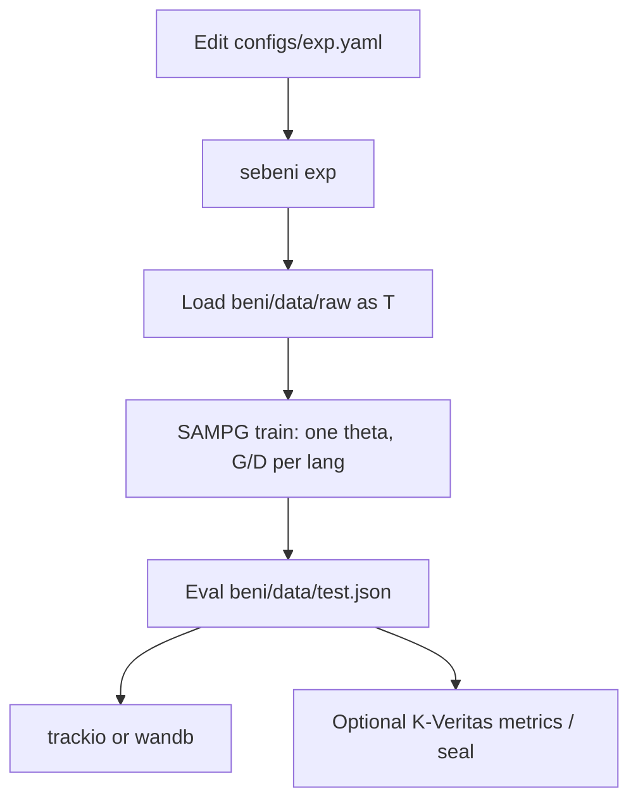

# Experiments

`sebeni exp` is the batteries-included path: **one multilingual policy** on all
packaged `beni/data/raw/*.txt`, then eval on packaged `beni/data/test.json`.
You edit a pre-config YAML for the model, hyperparams, and logger — not a data
path.

```bash
sebeni exp -c configs/exp.yaml -w ./runs/exp-001
# alias: sebeni experiment
```

If `-c` is omitted, Sebeni loads the packaged `exp.yaml`. `data.source` is
**ignored**.



## What gets loaded

| Split | Source | Language |
| --- | --- | --- |
| Train | `beni/data/raw/*.txt` | filename stem via `Language.from_code` (`mlq` → `mku`) |
| Eval | `beni/data/test.json` | object `{lang: text}`; paragraphs split; same aliases |

`bbo.txt` is included when present. Languages without a packaged baseline
use Distiller **scratch bootstrap**. The packaged raw split is about 36MB
(mostly `bam.txt`) so `sebeni exp` works after a GitHub install.

Custom `data.source` still applies to `sebeni train` / `eval` / `wordfreq`.
Only `exp` pins the packaged splits.

## YAML knobs

Edit [`configs/exp.yaml`](https://github.com/mlsftwrs/sebeni/blob/main/configs/exp.yaml):

- `model.model_name` (and LoRA / 4-bit)
- `algorithm: grpo | dpo | apo`
- `trainer.*` (`lr`, `max_steps`, `batch_size`, `num_generations`, …)
- `trainer.report_to: trackio | wandb | none` (default `trackio`)
- Distiller `provider` / `model` / `tau` / `enabled`

```yaml
experiment:
  kveritas: false          # emit KVERITAS_METRIC lines
  kveritas_seal: false     # if kveritas is on PATH, seal {working_dir}/exp/report.pdf
```

`report_to: wandb` needs `pip install "sebeni[train,wandb] @ git+https://github.com/mlsftwrs/sebeni.git"`.
Trackio stays in `[train]`.

## Artifacts

| Path | What |
| --- | --- |
| `{working_dir}/exp/eval.json` | Φ overall and `by_language` |
| `{working_dir}/models/` | Policy, tokenizer, model card, `safety_snapshot.json` |
| `{working_dir}/data/baselines/{lang}/` | G, D checkpoints |
| tracker | Trackio or Weights & Biases, per `report_to` |

## K-Veritas (optional)

Not a hard dependency. After eval, Sebeni can print lines
[K-Veritas](https://kveritas.org/docs) already understands:

```text
KVERITAS_METRIC name=phi value=0.51 step=0
KVERITAS_METRIC name=phi_bam value=0.60 step=0
```

Wrap the run:

```bash
kveritas init
kveritas run -- sebeni exp -c configs/exp.yaml -w ./runs/exp-001
kveritas seal --output ./runs/exp-001/exp/report.pdf
kveritas verify ./runs/exp-001/exp/report.pdf
```

If `experiment.kveritas_seal: true` and the `kveritas` binary exists, Sebeni
calls `kveritas seal` after the run. If missing, it warns with the install URL.
The Go binary is **not** vendored.

## Distiller keys

Same as `sebeni train`: set `GOOGLE_API_KEY` (default provider) or another
provider key. To skip Distiller, set `distillation.enabled: false` in the YAML.

## Next

- [Use cases](use-cases.md) for your own jsonl
- [SAMPG](sampg.md) for the loop `exp` is running
- [Hyperparameters](hyperparams.md) for every YAML key
