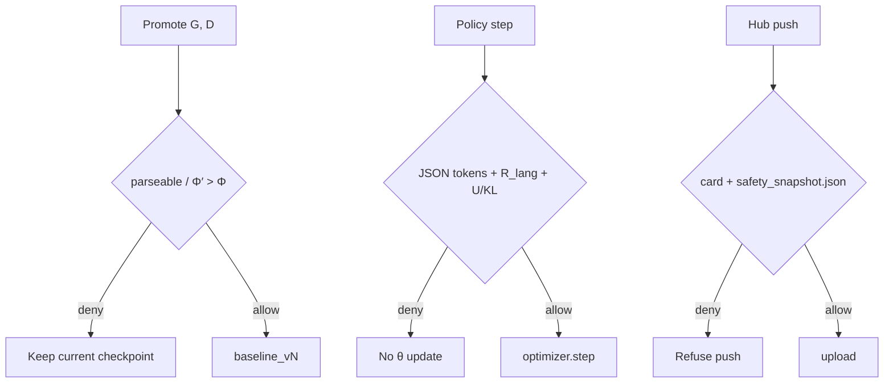

# Safety

`SafetyGovernor` is consulted on every SAMPG promote, policy update, and
Hub export. It encodes ELRL linguistic integrity **and** reward distrust
(noisy `π_rf` must not update θ unchecked).



## SafetySpec (default-on)

| Gate | Default | Effect |
| --- | --- | --- |
| Language identity | on | ISO/group required; `R_lang` vs **that row**; refuse a JSON `lang` that does not match the row's group. Mixed-language **datasets** are allowed. |
| Morphological integrity | on | τ and Φ′ > Φ on the batch texts using that language's grammar G and dictionary D; optional max MER |
| Reward distrust | on | Format-invalid batches cannot update; uncertainty U down-weights GC; KL-to-ref (`beta`) |
| Checkpoint integrity | on | Distiller writes `baseline_vN` only if gates pass |
| Release integrity | on | no Hub push without a model card and `safety_snapshot.json` (Φ, τ, checkpoint id) |

Scratch first-create uses the parseable-file gate; every later checkpoint uses
Φ′ > Φ.

Maninka: metadata `group_code` is **mku**; packaged files remain under
`baselines/mlq/`.

## YAML

```yaml
safety:
  enabled: true
  require_language: true
  refuse_mixed_language: true
  require_phi_improve: true
  max_mer: 1.0
  format_invalid_blocks_update: true
  uncertainty_downweight: true
  require_model_card: true
  require_safety_snapshot: true
  # max_kl: 0.5   # optional hard KL cap
```

τ is taken from `distillation.tau` (default 0.5). KL β is `trainer.beta`
(or the active DPO/APO `beta`).

U is computed per policy batch as
\(I(stage_{pred}\ne-1)+\beta\log((\pi_\theta+\epsilon)/
(\pi_{ref}+\epsilon))\). Morphological and LM tokens are averaged separately.
The update scale is \(1/(1+\operatorname{relu}(U))\), so negative U never
amplifies a step. `u_indicator`, `u_kl`, and `uncertainty` are release
indicators in `safety_snapshot.json`; they never gate G/D promotion.

## Python

```python
from beni.core.safety import SafetyGovernor, SafetySpec

gov = SafetyGovernor(SafetySpec(tau=0.5))
d = gov.allow_promote(phi=0.4, phi_prime=0.6, parseable=True, first_create=False)
assert d.allowed
```

`sebeni eval` writes `safety_snapshot.json` next to the policy so `sebeni push`
can pass the release gate.
