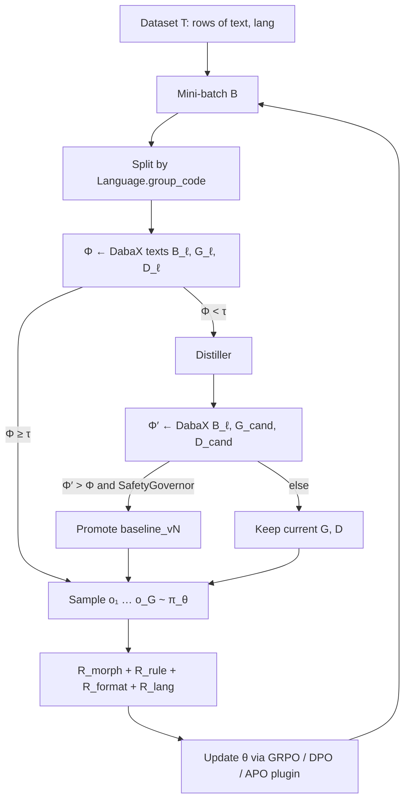

# SAMPG

**Self-Aware Morphotactic Pattern Generation** is the product loop. `sebeni train`
and `sebeni exp` **are** this loop. Completions are morphological analyses
(JSON `tokens`), not a chatbot.

## Dataset vs G, D

```
T  = [(text, lang), …]           # jsonl / csv / HF rows / packaged raw
B  ⊂ T                           # a training batch
Φ  = DabaX(texts(B_ℓ), G_ℓ, D_ℓ) # integrity of those strings
```

**G** and **D** are Daba grammar/dictionary files. They are not dataset
fields. Mixed-language batches are split by group code; the policy θ is
still **one** model.

## Loop

1. Distill G, D (HITL optional; scratch bootstrap if no packaged baseline)
2. For each batch: group by language; Φ ← DabaX
3. If Φ < τ: Distiller proposes \(G_{cand}, D_{cand}\); promote iff Φ′ > Φ
4. Sample completions; score \(R_{morph}\) / \(R_{format}\) / \(R_{rule}\) / \(R_{lang}\)
5. Update θ with GRPO (default) or DPO / APO plugin



`SelfAwareCallback` is the Φ / Distiller step (runs **before** the policy
update). `distillation_hook` is **KL scaling**, not Distiller.

YAML `algorithm: grpo | dpo | apo` changes only the policy-update plugin.
Register another with `register_algorithm(name, cls)`.

## Φ (morphological integrity)

Daba assigns a **stage** to each token:

| Stage | Meaning | Contribution to Φ |
| --- | --- | --- |
| \(0 \le x < 6\) | Fully matched / analyzed | 1.0 |
| 6 (EMPR) | Validated loanword / borrowing | `empr` (default 0.5) |
| −1 | Unrecognized | 0.0 |

Φ is the mean token score (recognized segments / tokens). If **Φ < 0.5**,
Distiller runs. It decides whether the miss is a missing lemma (`\lx`) or a
missing splitter / constraint (e.g. `{|na}`).

## Rewards

\[
R_{\mathrm{total}} = \omega_m R_{\mathrm{morph}} + \omega_r R_{\mathrm{rule}} + \omega_f R_{\mathrm{format}}
\]

Default weights: \(R_{morph}=0.4\), \(R_{rule}=0.4\), \(R_{format}=0.2\).
Sebeni adds \(R_{lang}\) (JSON `lang` must match **that row**).

- \(R_{morph}\): mean Daba stage score on completion tokens; stage −1 is
  heavily penalized.
- \(R_{rule}\): finite-state transitions from **G** (Select-Mark, valence
  `\vl`, lemma `\lx` / POS `\ps` vs **D**). Details: [Rewards](rewards.md).
- \(R_{format}\): valid **JSON** with a `tokens` list.
- \(R_{lang}\): JSON `lang` matches that row's group code.

## JSON completion schema

```json
{
  "text": "aw ka ne labato.",
  "lang": "bam",
  "tokens": [
    {
      "surface": "aw",
      "stage": 1,
      "analyses": [
        {
          "form": "áw",
          "ps": ["prn"],
          "gloss": "2sg",
          "morphemes": []
        }
      ]
    }
  ]
}
```

`lang` is the group code for **this sentence**. Do not mix languages inside
one JSON object.

## Policy-update plugins

| YAML `algorithm` | Class | TRL |
| --- | --- | --- |
| `grpo` | `SebeniGrpo` | `GRPOTrainer` |
| `dpo` | `SebeniDpo` | `DPOTrainer` |
| `apo` | `SebeniApo` | `DPOTrainer` + `apo_zero` / `apo_down` |

DPO/APO pairs: `chosen`/`rejected` or `completions`+`scores`.

```python
from beni.core.srl.unified import register_algorithm, SRLTrainer

register_algorithm("my_gc", MyPlugin)  # then YAML algorithm: my_gc
```

TRL notes: `GRPOTrainer` has no `ref_model` constructor argument (assign
after init); PEFT adapters are disabled on the reference; `beta` lives on
`GRPOConfig`.

## Multilingual

```yaml
data:
  default_lang: bam
  languages: [bam, mku, dtm]
```

```bash
sebeni init --lang bam --lang mku --lang dtm -w ./runs/manding-001
sebeni train -c ./runs/manding-001/config.yaml
```

- One language identity per sentence.
- Φ / Distiller / G, D per group (**mku** not mlq).
- `R_lang` vs **that row**.
- Mixing languages inside one JSON object scores 0.

Example config: `configs/grpo_multilang.yaml`.
